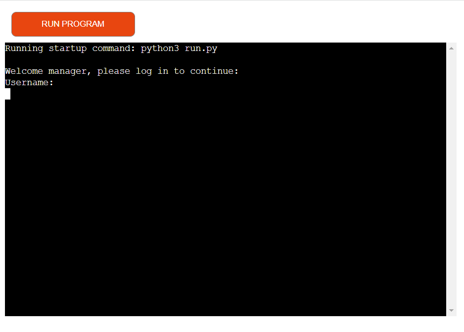
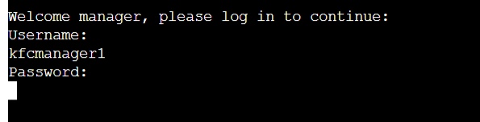
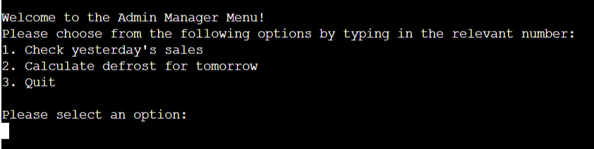
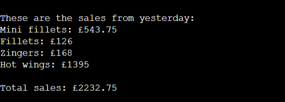
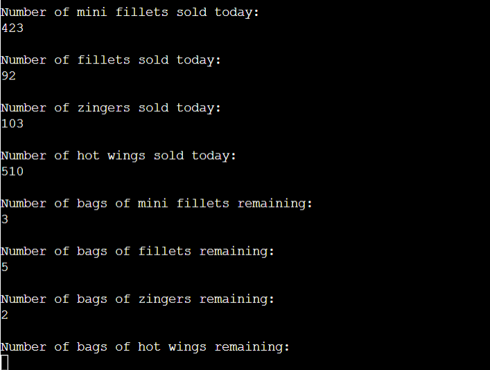
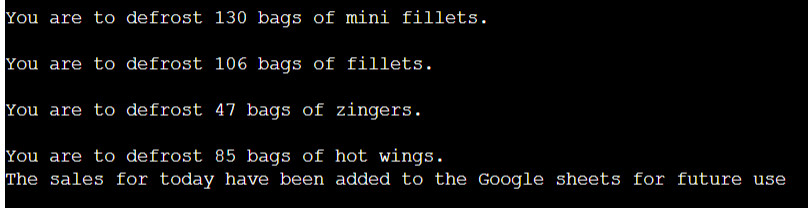

# Stock Check

Stock Check is a Python terminal app, which runs in the Code Institute Heroku mock terminal.

This app is created for managers at a KFC store to determine how much product to defrost overnight in preparation for the next day's sales.

The live version of this project can be found [here](https://stockcheck-f82cda1f5465.herokuapp.com/).

## Background

As someone who is currently a full time team member at a local KFC (yes, somehow I'm balancing a fulltime job with this course, don't ask), and who is fully trained on all team member stations, I am very knowledgable and involved with some of the ins and outs of running the store. This includes preparing products to be defrosted in preparation of the upcoming shift. Having gotten some insights from the Love Sandwiches sample project by Code Institute, this project is hence a means at attempting to recreate the system that is used to calculate how much product is to be defrosted using Python.

## Features

The app begins with a login screen, in which the user would be required to log in before accessing the main functionality of the app. I have created a custom login credentials for the purpose of testing and running this project, which if required could be gotten from me upon request.

For extra authenticity, I have made the password hidden as well (like with command line applications). I had found [this](https://www.geeksforgeeks.org/hiding-and-encrypting-passwords-in-python/) article which explained how to do so, which I've implemented in my project. 

Up next there is a Manager Menu, with various functionality options, where they can look at the previous day's sales, calculate the defrost for the next day, or quit the program. I have utilized user input validation to ensure that wrong data (i.e. the wrong option or invalid data) is properly handled and doesn't crash the program.

The program will display the sales made for the previous day. The program is connected to a Google Sheet worksheet where the sales for the previous days are stored, with the last row being the previous day's sales (assuming that it was updated at the end of each day). This part of the program basically just displays this information. After this, it redirects the user back to the main menu.

When the user selects to calculate the defrost for the upcoming day, the program asks them how much was sold in that day and how much on-hand defrosted product was left. Using this, the program calculates how much was made on that day, which is subsequently added to the Google Sheets worksheet. Using the information entered by the user, as well as the sales made from yestersay, the program is able to calculate how much defrost they should put in, which it then displays back to them to act on.

## Data Model

The data model used in this program is fairly simple. In the Google Sheets worksheet, the data is stored in a table of 4 columns, in the order of mini fillets, fillets, zingers and hot wings (the products requiring defrosting). Each row represent the sales made in a day for each product (in GBP), and the last row would represent the sales made the previous day.

In the program, the sales are calculated by multiplying the number of products sold by the unit cost of a single product. The costs of these products (which are not fully representative of their actual costs) have been noted down in the _[notes.txt](notes.txt)_ file, where the number of units in each bag of a product is noted, which helps in determining how much to prepare for the next day.

## Testing

This code was tested manually by doing the following:
- Running it through a PEP8 linter (pylinter) with no serious issues
- Given a variety of inputs (e.g. invalid string options like selecting 5 on the main menu, giving letters instead of numbers when the product sold today is requested, etc)
- Testing in my local terminal as well as the Heroku terminal

## Bugs
 - While testing my code, I found that in calculating the sales made (line 106-109 in [run.py](run.py)), I was concatenating the string literals rather than multiplying the numbers (so instead of 43 * 3 I'd get 434343). This has however been fixed by ensuring both values are converted to integers before multiplying them.
 - When calculating the defrost, due to improper use of arithmetic symbols I ended up with negative amounts of bags that were to be brought out for defrost. This has been fixed.
 - Shortly after deploying the app onto Heroku, when you put an invalid option in the main menu, it displays "choose option 1 or 2", (as I had added the exit function later on and forgot to change this, although the exit function works just fine). This has been fixed in the code, but hasn't been updated on Heroku.
- The calculated defrost can be a bit unrealistic at times. This I would require more time to properly look into building an algorithm that does a better job of calculating the defrost.

## Deployment Testing

This project was deployed using Code Institute's mock terminal on Heroku. This was done in the following steps:
- Create a new app
- Set buildbacks to `Python` and `NodeJS` respectively
- Added 2 _Config Var_ values, one with the JSON credentials required for the API to Google Drive and Google Sheets to work, and a `PORT` with the value of `8000`
- Linked Heroku to the repository
- Clicked on **Deploy**

## Credits

- Code Institute for the deployment terminal
- [GeeksForGeeks](https://www.geeksforgeeks.org/hiding-and-encrypting-passwords-in-python/) for information regarding `maskpass`, a library used in encrypting and hiding passwords in a command terminal.